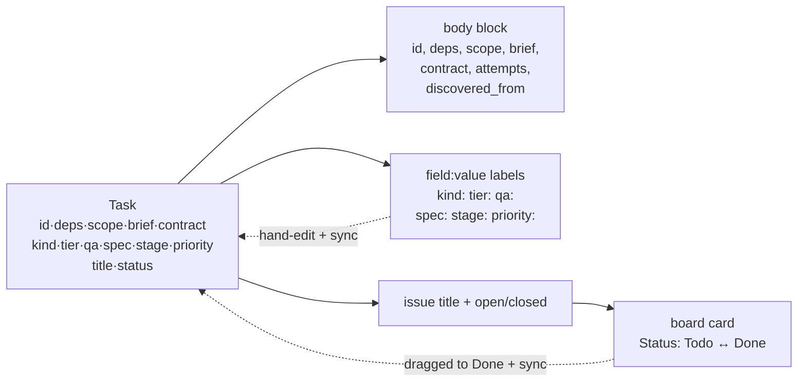
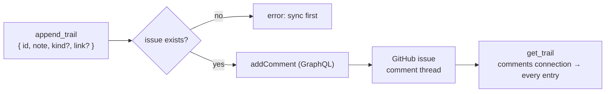
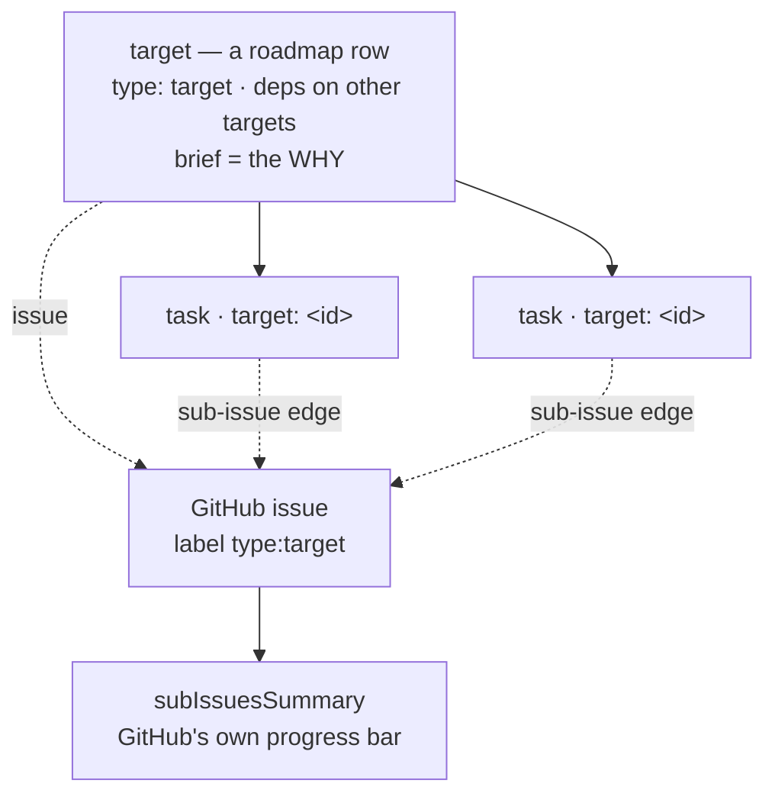
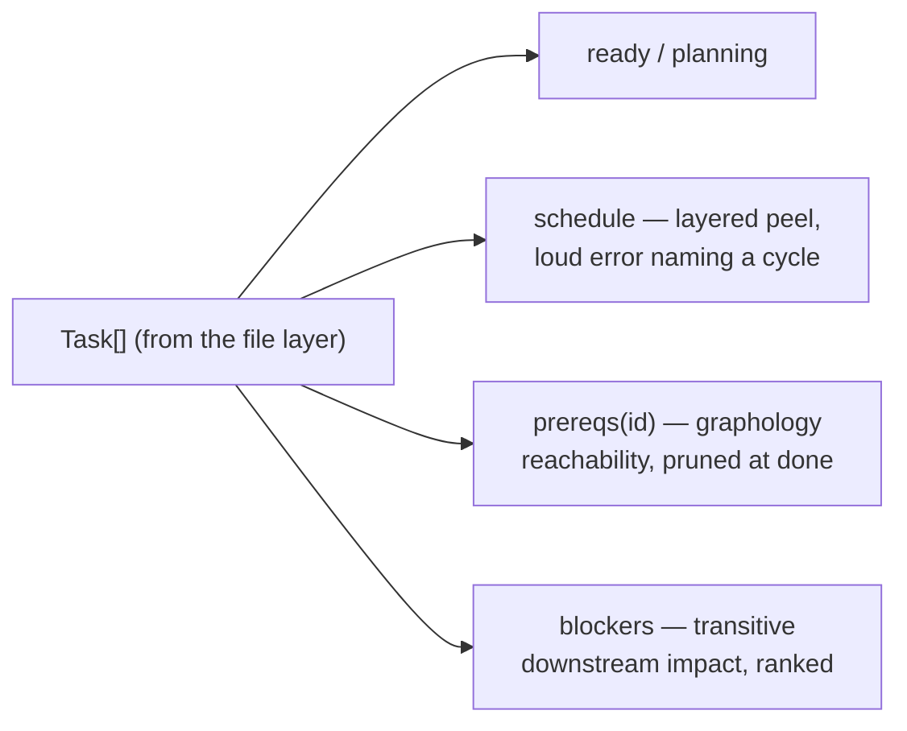
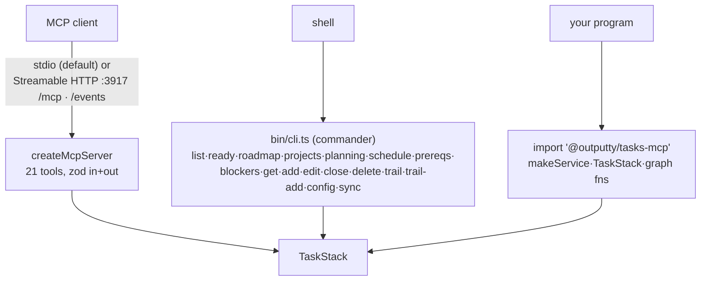
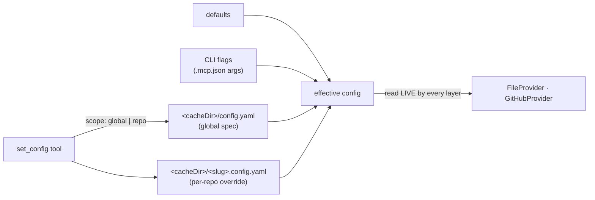
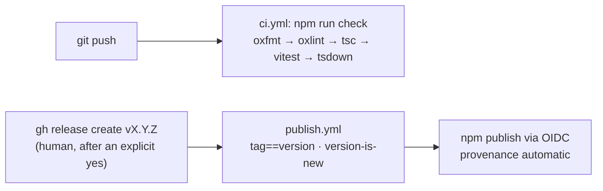

# tasks-mcp — Architecture

What exists and how it works. The forward plan lives in the `tasks` MCP server (see
[the roadmap altitude](#the-roadmap-altitude)); why each target is worth building lives in
`roadmap.md`; what we tried and what killed it lives in `lessons.md`.

## What we're building towards

One console over every tracker you run, showing what is being built right now across all of them, and
letting you change it without leaving the terminal.

The console has **shipped** (`tasks-mcp --tui`): it boots, connects, renders the queue, opens and edits
items, adds trackers, shows a real age for every live build, and redraws itself as work moves — the
mechanics below marked ✓. See the feature index below for what exists.

    tasks-mcp --tui        // the console. No flag still starts the MCP server; --http still serves it.

`--tui` starts a tracker for itself on an ephemeral loopback port and connects to it as an MCP client,
exactly as it connects to any tracker in its list. That is one code path, not two: the local tracker is
just the first entry, so pointing the console at a remote one later is a list edit rather than a second
implementation.

Output: the queue — every project's active work in one list, newest movement first (expected)

```
┌ tasks-mcp ──────────────────────────────────────────────── 2 trackers ─┐
│ PROJECT              TASK                        STATE        AGE      │
│ outputty/laygo       run-phases-refactor         in progress   14m     │
│ outputty/laygo       duckdb-appender-loader      in progress    2m     │
│ outputty/tasks-mcp   tui-detail-and-edit         in progress   41m     │
│ outputty/tasks-mcp   tui-trackers                ready          —      │
└ ↑↓ move · ⏎ open · a add tracker · q quit ─────────────────────────────┘
```

The list is `list_tasks` filtered in the console, **not** `list_ready` — `list_ready` excludes
`in_progress`, so a console built on it would hide the builds it exists to watch. ✓ shipped. (The AGE
column shows how long each in-progress task has been claimed: `list_ready` reports every claim's start
time in `claims`, so a healthy build reads a real, growing age and `—` means a ready task. A `/ filter`
key is not built.)

Output: one item, opened (expected)

```
┌ tui-detail-and-edit ─────────────────────────── outputty/tasks-mcp ─┐
│ state  in progress   tier 2   qa subagent   priority normal          │
│ target tui-console-1787751801        deps  tui-prototype (done)      │
│                                                                       │
│ ## Problem                                                            │
│ The console can list work but not act on it …                         │
│                                                                       │
│ TRAIL (4)                                                             │
│ 19:49  decision  SPEC round 1 — the console's shape …                 │
└ e edit · s state · c comment · n new idea · esc back ────────────────┘
```

Every write goes through the tools that already exist — `edit_task`, `start_task`, `close_task`,
`append_trail`, `add_task`. The console adds no write path of its own. ✓ shipped.

`a` adds a tracker: take a URL, prove it by calling `list_projects` (the MCP handshake, not `/health`),
show what came back, and only then write it to the console's tracker list (`<cacheDir>/console.yaml`). A
refused, timed-out, or non-MCP address reads distinctly and is never saved. ✓ shipped.

Live updates have shipped (`tui-live-events-…`): the console follows `GET /events` per tracker, each
event naming which project moved so it re-reads that tracker — local and instant — rather than trusting
a payload already stale by the time it is drawn. One stream per tracker, debounced and closed on quit; a
dropped stream shows `stream lost` and the console keeps running for its other trackers. Two edges it
does not cover: a trail comment raises no `/events` change (the detail view re-reads it on its own), and
a foreign delete of a cache file needs a manual refresh. ✓ shipped.

The tracker change that came first: `list_projects` and the `/events` watcher used to reconstruct a
project's id by relativising its cache file path, because the file carried only `tasks:`. A path-shaped
id then came back without its leading `/`, and a pre-identity orphan could not be told from a live
project (`tasks-mcp projects` once returned 33 rows, 32 of them dead). ✓ The cache file now declares its
own id, and both readers read it: an orphan lacks the key and is skipped (never deleted), and the id
round-trips verbatim.

⚠ Boundaries this does not cross. `append_trail` writes only the remote's comment thread and raises no
`/events` change, so the console re-reads a trail when it opens an item. Nothing authenticates the HTTP
transport, so a remote tracker is only as safe as the network it is on. And dragging is out: the ready
order is derived on every read, so a dragged permutation has nowhere to be stored.

## The provider stack

How tasks are stored and reconciled: the layers, the stack rules, and the patterns every
provider follows. The task ↔ GitHub wire format belongs to
[body block](#the-task--github-mapping); the graph questions belong to [graph engine](#the-graph-engine).

```mermaid
flowchart TB
    call["TaskStack (orchestrator)"] -->|"every read"| file["FileProvider — top layer\n&lt;cacheDir&gt;/&lt;repo&gt;-&lt;hash&gt;.yaml"]
    call -->|"writes fan down"| file
    call -->|"writes fan down"| gh["GitHubProvider — deepest = truth\nissues + board, GraphQL only"]
    gh -.->|"sync: deepest wins,\nmerged truth pushed back up"| file
```

### provider stack

`TaskStack` orchestrates `Provider[]`, built by `buildStack(remotes, options, config)` —
`[FileProvider, ...remotes]` for a configured `providers` list (`[FileProvider, GitHubProvider]` by
default; the singular `provider` is a one-element list), three layers in the stack test suite. Order is
authority order: every read is answered by the top layer; the deepest layer wins any sync
disagreement, and the merged truth is pushed back into each layer that lacks a task or
disagrees.

The other two rules: **absence is not a claim** — a task missing from a layer (an empty, newly
added layer included) is pushed into it, never deleted from the others, which makes adding a
layer a free migration — and **deletions never propagate**: a task can close everywhere but
only vanishes by hand.

#### Example

`tasks-mcp sync --project /abs/repo` → `{ "pulled": 8, "pushed": 0, "conflicts": 0 }`
(the `sync` example in `examples.md`, real observed on this repo).

#### Gotchas

- Registered remotes live in one table (`REMOTES` in `src/core/providers/provider.ts`); an
  unknown `--provider` fails loudly naming the known ones. Only `github` exists today.
- The stack is memoized per remote inside `TaskStack`; `buildStack` is a pure builder.

### file layer

`FileProvider`, the top of the stack: one YAML file per project under the OS cache dir
(`XDG_CACHE_HOME` or `~/.cache/tasks-mcp`, overridable with `--cache-dir`), keyed on the project id
verbatim (`<cacheDir>/<id>.yaml`, nesting on `/`) — never inside the user's repo. Every read tool (`list_ready`,
`prereqs`, `blockers`, …) is answered here: instant, offline, no network.

The file is disposable by design: `sync` reconstructs the full task, deps included, from the
layers below. A legacy `refs:` key in an old cache file still loads and is dropped on read.

#### Example

The `ready-and-planning` example in `examples.md` — both answers come from this file alone.

#### Gotchas

- Deleting the file loses nothing, but until the next sync the project reads as empty.
- `upsertMany` does one read + one write for a batch; sync uses it.

### GitHub layer

`GitHubProvider`: one issue per task, a card on the Projects v2 board, GraphQL end to end. It
wraps its own Octokit; the client is the one injection point (constructor parameter, defaulted
for production, passed by tests). A private index — task id → issue/card node ids, built from
one paginated listing pass and refreshed by every pull — keeps every GitHub handle below the
seam, so a same-id upsert can never duplicate an issue.

#### Example

The `add-task` example in `examples.md`: the created issue's labels and body block, observed
live on issue #13 of outputty/tasks-mcp.

#### Gotchas

- Issues are primary, the board best-effort — see [orchestrator/executor](#orchestratorexecutor).
- `updateIssue` re-sends the whole label set (foreign labels collected and preserved); it also
  pre-fetches the current body + labels per update — tracked as task `update-issue-prefetch`.

### corrupt-file quarantine

An unparseable task YAML is renamed `.corrupt` instead of failing every read: the file layer
continues empty, and the next `sync` rebuilds it from the layers below — safe under the stack
rules, since absence is not a claim and GitHub is deeper. Empty and header-only files read as
empty, not corrupt.

#### Gotchas

- The `.corrupt` file is kept for inspection, not deleted.

### first-wins duplicates

When two issues claim one task id (a race, or a hand-written block), every read and write
resolves deterministically to the OLDEST issue. `collate()` owns the rule once for both the
pull map and the upsert index. The collision is logged, flagged per task
(`ProviderState.conflict`), and `SyncResult.conflicts` reports the real count. Nothing is
auto-deleted; merging or closing the newer duplicate is a human call.

#### Gotchas

- Before v0.8.0 the NEWEST silently shadowed the record and `conflicts` was hardwired 0 — see
  `lessons.md`.

### init-once

There are no async constructors, so every provider has an explicit `async init(ctx)`:
credentials, the repo behind `origin`, the repository node id, the label set, and the board
(found or created) all resolve there, once per project — never lazily inside task calls. Reads
never trigger it; the first write or `sync` does. A memoized FAILED init is forgotten so the
next call retries.

### orchestrator/executor

A public method orchestrates: it sequences executor calls and assumes no knowledge of their
implementation (`create` = issue then board; `sync` = pull, merge, push). Executors
(`createIssue`, `syncToBoard`, `mergeRemote`, …) own the specific logic and let errors bubble.
The orchestrator catches only where business logic demands a fallback the executor cannot
decide: the board is best-effort, so board errors are caught and logged at the orchestration
seam while issue errors always propagate.

### one class per provider

Every provider is ONE class in ONE file implementing the `Provider` seam, wrapping its own API
client — no satellite modules (client/issues/projects were folded into `GitHubProvider` by
request; `ConfigProvider` sits beside the layers in `providers/config.ts`). All imports are
top-level; no lazy `await import(...)`.

### GraphQL-only

The GitHub layer speaks GraphQL only (user ruling 2026-08-17): one protocol, one kind of
handle (node ids) end to end. The board half is forced anyway — as of 2026-08, REST cannot
create a Projects v2 board, link one to a repo, or list a repo's linked boards. Do not port
issues to `octokit.rest.*`.

#### Gotchas

- Re-verify the REST gap against GitHub's docs before ever revisiting this ruling.
- Label mutations still need a preview accept header — see
  [label mutations need a preview header](#the-task--github-mapping).

### delete semantics

Delete is an **explicit, intentional** operation — the counterpart to, not a violation of, "deletions
never propagate." That rule is about `sync`: an *accidental* absence in one layer is restored, because
absence is not a claim. `delete_task` is the deliberate opposite, and it fans **deepest-first**:
`GitHubProvider.delete` removes the board card best-effort (`deleteProjectV2Item`), then `deleteIssue`
(permanent); only then do the shallower layers drop it.

#### Gotchas

- Deepest-first is the whole point: a permission refusal on GitHub throws **before** the local cache is
  touched, so there is no half-deleted state for the next `sync` to resurrect.
- `deleteIssue` needs the token's delete-issue permission (repo admin/triage); a normal token cannot,
  and the error propagates rather than being swallowed.
- A layer that does not implement `delete` is skipped — it cannot be deleted from, and the task would
  resurrect on the next sync. The file and GitHub layers both implement it.
- Deleting a **target** that still holds tasks is refused, naming them: the alternative is silently
  orphaning work under a roadmap row that no longer exists.

## The task ↔ GitHub mapping

What a task looks like on GitHub: the body block, the labels, the board, and how strangers'
issues join. The stack rules that decide who wins a disagreement belong to
[provider stack](#the-provider-stack).



### body block

A hidden YAML block leads every managed issue's body:

```
<!-- outputty:task
id: readme-prereqs-order
deps: []
scope:
  - README.md
brief: "README.md's prereqs example outputs order [[schema],[api,infra]] ..."
-->
```

(real observed, issue #13 of outputty/tasks-mcp — the `add-task` example). `id` comes first —
the stable key that survives title edits. The block carries only what labels cannot: `deps`,
`scope`, `brief`, `contract`, `attempts`, `discovered_from`. An issue is **managed** iff its
body carries the block.

### visible spec (below the block)

The block is a hidden HTML comment, so an issue whose whole record lived only there rendered
**blank** in GitHub's web UI. Below the block `renderBody` now emits a **visible, concise summary** —
the brief (the problem and expected solution) as the lead, then `**What to account for**` (the
contract) — wrapped in `<!-- outputty:spec -->` … `<!-- /outputty:spec -->` sentinels:

```
<!-- outputty:spec -->
README.md's prereqs example outputs order [[schema],[api,infra]] — an order the engine can't produce.

**What to account for**

prereqs('deploy') returns dependency-ordered layers, verified by a run.
<!-- /outputty:spec -->
```

Metadata (`scope`, `deps`) stays in the machine block, out of the summary — the visible body is a clean
read, not a field dump. It is **regenerated on every write** (never read back — the block stays the
source of truth), so it can never drift from the task. `parseBody` strips the sentineled region so it is
not mistaken for human prose; prose a human writes *below* the region is still preserved across updates.

#### Gotchas

- The visible spec is MCP-owned: a hand-edit *inside* the sentinels is overwritten on the next write.
  Durable human notes go below the region, or into the issue's comment thread (the task's trail).
- Existing issues written before this feature have no sentineled region; they gain one the next time
  their task is written (a plain `sync` won't rewrite an unchanged task — see roadmap #7).
- Labels win over a legacy block that still carries scalar fields (pre-v0.8 issues).
- The block IS the management marker — there is no marker label anymore.
- **`-->` inside the block is escaped to `--&gt;`.** It terminates an HTML comment by spec, and a
  mermaid arrow is exactly that — so a brief with an inline diagram used to close the block early,
  spill YAML into the visible body, and read back truncated mid-diagram with the YAML still parsing,
  so nothing ever errored. `parseBody` also matches the terminator as a `-->` ALONE on its line, which
  recovers a body written before the escaping instead of cutting it at the first arrow.

### field:value labels

The execution properties — `kind`, `tier`, `qa`, `spec`, `stage`, `priority` — are worn as one
GitHub label each (`tier:2`, `priority:high`), color-coded per field, created on demand. Edit a
label in the GitHub UI and the next `sync` pulls the change into the task.

**Only a label that says something is written.** Absence already means the default — `tierOf`
returns 3, `qaOf` returns subagent, `priorityOf` returns normal, an absent `spec` counts as
settled, a record with no `type` is a task — so a `tier:3` label would sit on nearly every issue
in the repo carrying no information. `wearsLabel` compares against `DEFAULTS` in
`src/core/types.ts`, the one source the validators read too, and writes only what GitHub cannot
otherwise show: `tier:1`, `priority:high`, `spec:drafting`, `type:target`. `status` is narrower
still — GitHub's own issue state shows open AND closed, so only `status:in_progress` is worn.

Two consequences worth knowing: setting a field back to its default DROPS its label, and
removing a field outright is what `edit_task`'s `clear` exists for.

A hand-typed junk value (`tier:banana`) parses to `undefined` and is ignored, never crashed on.
`labelFields` config narrows which properties become labels; `labels: false` turns label sync
off entirely (and with it, tags).

#### Gotchas

- The value domains the parser accepts are the const arrays in `src/core/types.ts` — one
  source for types, validators, zod enums, the parser, and now the defaults.
- Existing default labels are cleaned by a plain `sync`, no edit needed: `wearsStaleLabel` makes
  the pull flag `reconcile` on an issue wearing one, because both layers otherwise AGREE on the
  task and nothing would push. One sync rewrites the issue, the next reports `pushed: 0`.
- That check is deliberately narrower than "the labels differ from what we would write":
  narrowing the `labelFields` preference must stay NON-destructive, and any-difference would turn
  it into a purge. It asks `wearsLabel` about the parsed value alone and never reads the config.
- Junk (`tier:banana`) is stale by the same rule, so a sync now cleans that too.
- A GitHub search for `label:"tier:3"` no longer matches anything. Search for the absence.

### tags

Any label that is NOT one of ours is a **tag** — `security`, `frontend`, `help wanted`. Tags are
adopted into `task.tags` on every pull, so a label a human adds in the web UI flows back like any
other edit, and a write then makes the issue wear exactly the tags the task carries.

`add_task` / `add_target` / `edit_task` all take `tags` (an array or comma string); on `edit_task`
it REPLACES the list, the same contract `deps` and `scope` have.

#### Gotchas

- A task that has never been pulled has no `tags` at all, and `keptLabelIds` leaves its labels
  untouched. That is the migration grace: nothing a write has not seen can be dropped by one.
- A tag shaped like one of ours (`tier:9`) is REFUSED at the authoring surface. It would be read
  back as that field on the next pull, its junk value ignored, and silently vanish.
- The listing query reads `labels(first:50)`. An issue wearing more would truncate on adoption.

### kanban board

Each task-issue is added to a Projects v2 board and its **Status** column tracks the task:
`open → Todo`, `done → Done` — and flows back, a card dragged to Done marking the task done on
the next `sync`. By default the server finds or creates a board named **Tasks** linked to the
repo (observed live: board "Tasks", project number 2 on outputty/tasks-mcp); `projectNumber`
targets an existing board; `--no-projects` turns it off.

#### Gotchas

- Best-effort: a board hiccup is a warning, never a lost task — the issue write decides
  success.

### adoption

`sync` imports any repo issue WITHOUT the block as a task `gh-<number>` and stamps its body,
preserving the human's prose below the block — so an issue a teammate opened by hand is
tracked from then on, round-tripping like any other task.

#### Gotchas

- Adoption exists because the id left the labels for the body (v0.2): without a label, only
  stamping makes a hand-opened issue visible to future syncs. See `lessons.md`.

### project scope requirement

The board needs the token's `project` scope. Without it, tasks still land as issues and the
board sync is skipped with a warning (verified live, 9f28db0). One-time fix:

```
gh auth refresh -s project
```

### label mutations need a preview header

GitHub's `createLabel` GraphQL mutation is still behind an API preview: label mutations send
`accept: application/vnd.github.bane-preview+json` (`src/core/providers/github.ts:427`).
Re-verify against GitHub's changelog before removing the header; dropping it breaks on-demand
label creation.

## Per-task trails

A task's **trail is its GitHub issue comment thread**. There is no separate trail store — the provider
that owns the issue owns its comments, so trails ride the same [GitHub layer](#the-provider-stack) as
tasks. `append_trail` posts a comment; `get_trail` reads the whole thread. **Every comment is an entry**,
people's comments included.



### The seam

The `Provider` interface gained two **optional** methods, `getTrail` / `appendTrail`. `GitHubProvider`
implements them; `FileProvider` does not. So the service's `getTrail`/`appendTrail` walk the stack from
the bottom and use the **deepest layer that backs trails** — GitHub. A file-only project (no remote)
has no trail surface and the call throws `trails need a GitHub-backed project`.

- `appendTrail(id, entry)` → look up the issue node id in the layer's task→issue index → `addComment`
  → re-read the thread. No issue for the id (never synced) → `no task <id> on GitHub — sync it first`.
- `getTrail(id)` → the issue's `comments` connection, paginated, oldest first. No issue → `[]`.

### Every comment is an entry, kind/link on a hidden marker

An entry is `{ note, kind?, link?, author?, at? }`. `note` is the comment body; `author` (GitHub login)
and `at` (ISO 8601) come from GitHub on read. Because **every** comment counts, a comment a person wrote
by hand comes back as a bare `note` plus its `author`/`at`.

`kind` (`decision` · `action` · `note`) and `link` are optional and only outputty writes them — encoded
in a leading `<!-- outputty:trail kind=… link=… -->` marker, then the note. The marker is an HTML
comment, so GitHub renders the comment as plain text; `splitMarker` parses it back on read. Real observed
(the `trail-journal` example): a `decision` comment round-trips its kind and link; a plain `note` comment
comes back with neither.

#### Gotchas

- Reads hit the network (there is no local trail cache) — unlike task reads, which the file layer
  answers offline.
- `append_trail` needs the issue to exist first. A task created offline, or before its first `sync`, has
  no issue to comment on yet.
- `kind` must be one of `TRAIL_KINDS`; a junk `kind` on append is rejected. A junk `kind=` in a
  hand-written marker is ignored on read (the entry keeps its note).
- History: the first cut (v0.9.0, shipped to npm) stored trails in a local `.trails/<id>.yaml` file,
  never synced. Reworked minutes later in v0.10.0 (ruled 2026-08-17) to back them with issue comments —
  one provider for tasks and their trails. Both versions are published. See `lessons.md`.

## The roadmap altitude

The graph holds two kinds of record. A **task** is a unit of work. A **target** is a roadmap item: it
groups the tasks that serve it, it is never dispatched, and its progress is **derived** from those
tasks rather than maintained by anyone. One field distinguishes them (`type`), one field joins them
(`target`), and the engine that already answered the two planning questions answers them one altitude
up for free — `prereqs('<target>')` is "what must ship before this", `blockers` ranks targets by reach.



### target

A target is a `Task` record wearing `type: target`. It carries the same id, title, deps, brief and
trail as anything else — a roadmap row IS the task shape, which is why adding the altitude needed no
second record type, no second seam, and no second store. Its `brief` is the **WHY** (what makes this
worth building), not an implementation spec; the spec belongs to the tasks under it.

**What a target is, is enforced, not documented.** Sharing the task shape means a target can drift
into a second, worse task, and a roadmap of placeholder rows ranks nothing — so two guards run in
`TaskStack.create` / `.update`:

- `assertTargetWhy` — a target needs a **title and a brief**, both, before it exists. Enforced on
  CREATE and on PROMOTION (`edit_task { type: "target" }`), never on a later edit, so a row filed
  before the rule can still be closed.
- `assertTargetFields` — a target may carry no **build fields** (`scope`, `contract`, `tier`, `qa`,
  `stage`, `discovered_from`): nothing ever builds a target, so those describe work that does not
  exist. It may not serve another target either — the roadmap is one altitude. It runs only when the
  edit TOUCHED the shape (a build field, `type`, or `target`) — `touchesTargetShape` — so a
  status-only change like `close_task` is never refused because someone hand-labelled the issue
  `tier:2` in the web UI and `sync` adopted it.

What a target DOES carry is `deps` (the targets that must ship first) and `priority` — and both rank
every task underneath it, see [ready / planning / schedule](#ready--planning--schedule).

`add_target` files one. `roadmap` reads every target back with its derived progress, the tasks under
it that could start right now, what it is still `waitingOn`, and the targets it `blocks`.

#### Gotchas

- **A target is never `ready`.** `ready()` filters it out, so nothing can dispatch a roadmap row as if
  it were a single build. A target whose `spec` is still `drafting` does appear in `list_planning` —
  that is exactly the stage that owns it.
- A target still schedules and still counts as a blocker: `schedule`, `prereqs` and `blockers` treat it
  as an ordinary node, which is what makes target-level dependency questions work.
- `roadmap` tolerates a cycle among targets and falls back to the given order. Order there is a
  display; `schedule` owns the cycle error contract.
- `sync` stays tolerant of both guards. It records what GitHub already says, so a legacy target with
  no brief pulls in fine; only the authoring surfaces refuse one.

### the sub-issue edge

A task's `target` **is** its issue's parent on GitHub — `addSubIssue` with `replaceParent`, so a move is
one mutation and there is no detached moment. The edge is the field's one home: it is not written into
the body block, so re-parenting an issue in the GitHub web UI flows back on the next sync, the same
contract a card dragged to Done already had.

Membership costs nothing to read. `parent` rides the listing query the provider already pages through
(measured live against `outputty/tasks-mcp`: adding `parent` and `subIssuesSummary` left `rateLimit.cost`
at 1 and `nodeCount` at 2100), and GitHub renders the hierarchy and its progress bar natively.

#### Gotchas

- **Best-effort, like the board.** GitHub caps a parent at 100 sub-issues and refuses one whose
  repository owner differs; neither is worth failing the task write over, so the edge is skipped with a
  warning and the issue still lands.
- `type` rides the body block **as well as** its label. With `labels: false` the label is never
  written, and a target that round-tripped as a plain task would be offered to `ready` and built.
- Only a target wears `type:target`. Labelling `type:task` would put a redundant label on every issue
  in the repo — the same reasoning that keeps `status:open` off every issue.
- Authoring refuses a target that does not exist, or one that is really a task. `sync` stays
  **tolerant**: it records what GitHub already says, including a parent that is not a managed target.
- `sync` pushes targets ahead of the tasks that name them, so a first sync attaches the edge in one
  pass rather than leaving it a cycle behind.

### what the roadmap altitude does not model

**Per-target Projects v2 boards.** One board per roadmap item is feasible — a repo can link many, and
`createProjectV2` takes a `repositoryId` — but each one costs a paged read per sync, against a file
layer whose whole point is that reads are local. A single-select `Target` field with a grouped view on
the one `Tasks` board gives the same picture for one read. See `lessons.md`.

## The graph engine

The pure heart: every graph question is a function of `Task[]` — no I/O, no provider, directly
unit-tested. How tasks get INTO that array belongs to [provider stack](#the-provider-stack); how
the answers reach a caller belongs to [surfaces](#the-surfaces).



### graph engine

`src/core/graph.ts`. Reachability (`prereqs`, `blockers`) runs on
[graphology](https://graphology.github.io/) — the maintained standard. Traversal prunes at
done tasks: a finished task already satisfied its side of the graph, so it never appears in an
answer. `schedule` keeps its 15-line hand-rolled peel because its error contract — naming the
cycle's members — is API.

#### Example

The `schedule` example in `examples.md`: the canonical graph peels into
`[["infra","schema"], ["api"], ["deploy","ui"]]` (real observed).

### prereqs

"I want to start on X — what has to be done first?" Answers with `startable` (nothing in the
way), `order` (dependency-ordered layers: finish layer 1, then 2, then start X), and the full
records of every task named.

#### Example

The `prereqs` example in `examples.md` — real observed on the canonical graph:
`{ "id": "deploy", "startable": false, "order": [["infra", "schema"], ["api"]], ... }`.

#### Gotchas

- Done deps end the chain and never appear; `startable: true` comes with an empty `order`.
- The README's example output disagrees with the engine — tracked as task
  `readme-prereqs-order`.

### blockers

"What holds up the most work right now?" Every open task ranked by `blocks` — how many open
tasks transitively wait on it — with `blocked` (their ids), `highPriorityBlocked` (the
high-priority ones, for priority alignment), and `unblockedBy` (the dependency-ordered path to
make it workable; empty means work it now). The whole answer computes from one graph, built
once.

#### Example

The `blockers` example in `examples.md` — real observed: `schema` first with `blocks: 3`,
`unblockedBy: []`.

### ready / planning / schedule

The working set. `ready` = open, spec settled, every dep done, and NOT a target — what a build
sweep dispatches. `planning` = spec `drafting` or `replan` — what the planning stage still owns.
`schedule` = the whole open plan as layers; a dependency cycle is a loud error naming its
members, never a silent drop.

`eligible` (behind `list_ready`) RANKS the ready set across **both altitudes**:

    score = (blocks + 1) x priorityWeight(task) x roadmapWeight(its target)

`blocks` counts open TASKS only; roadmap reach is counted separately over targets, so the two
altitudes never mix into one integer. The roadmap weight is
`priorityWeight(target) / ORDINARY x (targets waiting on it + 1)` — normalized so a
normal-priority target that blocks nothing weighs exactly **1**, which is also what a task with
no target gets. Nothing is penalised for having no roadmap row; only a target that is genuinely
more (or less) than ordinary moves its work.

One thing is a **tier rather than a factor**: a task whose target still waits on an unshipped
target sorts BELOW every task whose roadmap row is clear. That is categorical — the plan says
"not yet" — not a matter of degree, so no weight could express it honestly. Each ready row
carries the `roadmap` standing that ranked it (`target`, `priority`, `blocks`, `waiting`,
`weight`), so the order is legible rather than a bare number.

#### Gotchas

- A target's dep is a soft rank, never a gate. Gating would deadlock the queue on a human
  action: a target's tasks can all be done while its issue stays open, because a target ships
  when someone says so — `close_task` — and a target can ship with work deliberately deferred.
- "Shipped" for a target dep means `status: done`, exactly like every other dep in the graph.

#### Example

The `ready-and-planning` example in `examples.md`: this repo's own tracker after bootstrap —
six ready, two in planning.

## The surfaces

The three ways in — MCP tools (primary), CLI (human/scripts), library (importable core) — all
over the same `TaskStack`. What the tools DO belongs to [graph engine](#the-graph-engine) and
[provider stack](#the-provider-stack); this file covers how a caller reaches them.



### MCP server

The primary surface: `createMcpServer` on the official `@modelcontextprotocol/sdk` — never a
hand-rolled JSON-RPC handler. 21 tools (`list_ready`, `roadmap`, `list_planning`, `schedule`,
`list_tasks`, `list_projects`, `get_task`, `add_task`, `add_target`, `amend_task`, `edit_task`,
`start_task`, `close_task`, `delete_task`, `get_trail`, `append_trail`, `sync`, `prereqs`, `blockers`,
`get_config`, `set_config`), each declaring zod input AND output schemas and
returning `structuredContent`. Every tool takes `project` — an opaque, supplied id, optional because a
`--project-id` default fills an omitted one — except `list_projects`, which takes none and answers about
the server itself.

Transports: `StdioServerTransport` (default) and stateless Streamable HTTP (JSON responses) on
plain `node:http` — no framework; the server itself answers non-POST `/mcp` with `405 + Allow`
so the SDK transport can never hold a GET open as SSE. A third route, `GET /events`, is the one
held-open connection: an SSE change stream (see the change stream below). `--http` binds `127.0.0.1`
unless `--host` opts out. `SERVER_INFO` reads name/version from `package.json` at build time.

#### Example

The `mcp-registration` example in `examples.md`.

#### Gotchas

- Reads never touch the network (file layer); the first GitHub-touching call (a write, or
  `sync`) runs init once — repo, credentials, labels, board.
- The `sync` tool's description still advertises the dead seed mechanism — task
  `sync-tool-desc-seed`.

### CLI

`bin/cli.ts` on commander (user ruling: a real CLI library, never homebrew argv parsing). With
no command it runs the MCP server; subcommands drive the core directly: `list`, `ready`, `roadmap`,
`projects`, `planning`, `schedule`, `prereqs <id>`, `blockers`, `get <id>`, `add <id>`, `edit <id>`,
`close <id>`, `delete <id>`, `trail <id>`, `trail-add <id>`, `config`, `sync`, `identify`. `projects`
takes no `--project` (it asks about the server); every other subcommand resolves its id as `--project`,
else `--project-id`, else the `--project-id` the repo's checked-in `.mcp.json` declares, else a loud
failure — never the cwd (`bin/resolve-id.ts`). The deployment flags work on every command.

#### Example

The `ready-and-planning` example in `examples.md`.

#### Gotchas

- No `amend` subcommand (MCP-only), and `config` is read-only (set via `set_config`) — known
  asymmetries.
- `prereqs`/`blockers` print compact forms (layers only; blockers as a flat table without
  `unblockedBy`) — the MCP tools return the full shapes.

### library

The core is importable; the MCP layer is a wrapper, never a requirement. `.` exports
`makeService`/`TaskStack`, `FileProvider`/`GitHubProvider`/`buildStack`/`resolveRemotes`, the pure graph
functions (`ready`, `planning`, `schedule`, `prereqs`, `blockers`, `priorityOf`),
`ConfigProvider`/`ProjectConfigSchema`/`validateProjectId`, `DuplicateTaskError`,
`ChangeBus`/`readProjectSummaries`, and the types.
`./mcp` exports `createMcpServer`/`createHttpServer`/`startHttpServer`/`runStdio`.

#### Example

The `library-blockers` example in `examples.md` — real observed output: `schema`.

#### Gotchas

- v0.7.0 broke this surface once: `CachedTaskService` → `TaskStack`, `stackFor` → `buildStack`
  (v0.8.0), `Cache`/`Refs`/`CacheEntry`/`providerFor` gone.
- The identity change broke it again: `projectSlug`/`repoRoot`/`repoSlug` are gone (a project id is
  supplied and used verbatim, so nothing hashes a path), replaced by `validateProjectId`.

### branch parameter unused

`ProjectContext.branch` (`src/core/types.ts:55`) is declared, documented ("the backend decides
how it uses this"), accepted by every tool schema — and read by nothing, in any of the 16
commits since the initial import. Ruled (grill 2026-08-17): REMOVE it — task
`unused-branch-param`, spec settled, ready to build. Probe: `rg '\.branch' src/` finds only
the pass-through.

## Configuration

Two distinct kinds of knob: user preferences (central config, set through the server) and
deployment flags (how the server itself is launched). Nothing is ever configured by files
inside the user's repo.



### central config

`ConfigProvider` — one class in `src/core/providers/config.ts`, beside the layers it
configures. Preferences are written only via the `set_config` MCP tool and stored beside the
task caches: one **global spec** (`<cacheDir>/config.yaml`) applying to every repo,
overridable per repo (`<cacheDir>/<slug>.config.yaml`). Precedence, weakest first:
defaults < CLI flags < global spec < per-repo override. `get_config` shows every layer plus
the effective result (the CLI's read-only `config` command prints the same).

Configurable: `provider`, `projects`, `projectNumber`, `board`, `labels`, `labelFields`.
Files are zod-parsed (`ProjectConfigSchema`): an unknown key or mistyped value fails loudly,
naming the file. Config reads are mtime-memoized and taken LIVE — a `set_config` affects the
very next write, and the GitHub layer's state cache is keyed by the effective config, so
board/projects changes rebuild state like label changes.

#### Gotchas

- The in-repo `.claude/tasks-mcp.config.yaml` of v0.2–v0.7 is gone — see `lessons.md`
  ("Configuration left the user's repo for the server").
- Every layer shares the ONE ConfigProvider instance; `GitHubProvider` requires it (no silent
  default).

### deployment flags

How the server is deployed — set once, in `.mcp.json`'s `args` (or the shell): `--http` /
`--port <n>` (transport; stdio default, HTTP on 3917), `--provider <name>` (default `github`),
`--project-number <n>`, `--no-projects`, `--board <title>` (default `Tasks`),
`--cache-dir <dir>` (default OS cache dir). Credentials are environment-only:
`GITHUB_TOKEN` / `GH_TOKEN`, else `gh auth token`.

#### Example

The `mcp-registration` example in `examples.md`; with flags:
`{ "args": ["-y", "@outputty/tasks-mcp", "--no-projects"] }`.

#### Gotchas

- Flags sit BELOW the global spec in precedence: a `set_config` value overrides a flag. Flags
  are deployment defaults, not rulings.

## Toolchain, tests, and releasing

The development machinery: the build gate, the test discipline, the runtime split, and the
publish pipeline. Product behavior belongs to the other topic files.



### oxc toolchain with working-set caps

One toolchain end to end: oxfmt (formatting), oxlint (linting **with build-enforced caps**:
complexity ≤ 7, ≤ 24 lines per function, nesting ≤ 3, no-else-return with else-if banned),
TypeScript 7 (the native compiler) for typechecking, vitest, tsdown (Rolldown + oxc) to
`dist/`. `npm run check` chains exactly what CI runs — run it before calling any change done.

Fix a cap violation by decomposing, never by loosening the threshold; a deviation is a
targeted disable comment with a written why (the one on `createMcpServer`'s declarative tool
table is the standing example).

#### Gotchas

- `oxc-transform` is the low-level API inside tsdown, not a tool to drive directly.
- oxfmt reads `.prettierignore`; plugin-managed files (`CLAUDE.md`, `.claude/`) are excluded
  there.

### e2e tests nock at the wire

Tests drive the real stack — provider, service, protocol, transport — and fake only the wire:
**nock** answers api.github.com (GraphQL), test repos are real `git init` temp dirs (repo
resolution runs for real), and the MCP suite connects the official SDK client over real HTTP.
No in-memory fake providers. Two carve-outs: `graph.ts` keeps pure unit tests (no I/O to
mock), and `MockProvider` exists only as the controllable deepest layer in the stack-semantics
suite.

#### Gotchas

- A test that times out at exactly its limit is hanging, not slow — the standing example is
  the MCP hang fixed by 405-on-non-POST + `closeAllConnections` (see `lessons.md`).

### runtime portability

The published package runs on Node ≥ 18 **and** bun; developing needs Node ≥ 22. No Bun-only
APIs in `src/`/`bin/` — `yaml`, `node:crypto`, `node:child_process`, `node:http`, process
streams. Two hard edges:

- `npm test`, **never `bun test`**: nock needs Node's fetch and cannot intercept Bun's.
- tsdown loads its TS config via the optional `unrun` peer on Nodes without native type
  stripping; `unrun` needs `Promise.withResolvers`. CI runs Node 26 (the floor the `--tui`
  console's renderer needs — `@opentui/core`'s FFI wants Node 26.4+, and `engines` now says
  `>=26.4.0`); vitest passes `--experimental-ffi` to its workers via `vitest.config.ts`.

### publish pipeline

Pushing code never publishes — a push only runs CI. Publishing fires ONLY when a GitHub
Release is published: `publish.yml` guards tag == `package.json` version and version-is-new,
runs the full check, then `npm publish` via **OIDC Trusted Publishing** — no stored token,
provenance attached automatically. Real observed: 0.5.0/0.6.0/0.7.0/0.8.0 on the registry.

The human rule (CLAUDE.md): when shippable code changes and tests pass, ASK whether to
release; never create a release unprompted. On a yes: bump version, commit, push,
`gh release create vX.Y.Z --generate-notes`.

#### Gotchas

- The first publish of a NEW package must be manual — OIDC cannot create one.
- The trigger pivoted Release → tag-push → Release in one day; the settled reasoning is in
  `lessons.md`.

## The seams

### TaskStack -> Provider

- **from** TaskStack **to** every layer (FileProvider, GitHubProvider, ...)
- **in** init(ctx) once per project; pull(ctx); upsert(ctx, task) / upsertMany(ctx, tasks)
- **out** pull returns Map<taskId, ProviderState> ({ task, reconcile?, conflict? }); upsert returns void — handles stay private

### MCP client -> server

- **from** any MCP client (Claude Code, ...) **to** createMcpServer over stdio or Streamable HTTP
- **in** tool name + zod-validated args, always { project } (abs repo path)
- **out** structuredContent matching the tool's zod output schema

### CLI -> core

- **from** bin/cli.ts (commander) **to** TaskStack + graph functions
- **in** subcommand + flags (add/close/sync write; the rest read)
- **out** JSON on stdout (compact table forms for prereqs/blockers)

### GitHubProvider -> GitHub

- **from** GitHubProvider (its own Octokit) **to** api.github.com/graphql
- **in** GraphQL queries/mutations only; node-id handles; label mutations wear the bane-preview accept header
- **out** issues + board cards; pull rebuilds the full task from body block + labels + state

### Release -> npm

- **from** gh release create vX.Y.Z (human, after an explicit yes) **to** publish.yml -> npmjs
- **in** a published GitHub Release whose tag equals package.json version
- **out** @outputty/tasks-mcp@X.Y.Z on npm, OIDC-signed provenance attached

## Feature index

| Feature | Kind | What it is |
| --- | --- | --- |
| provider stack | feature | Tasks live in an ordered list of layers; reads come from the top, truth comes from the bottom, and sync makes every layer agree. |
| file layer | feature | The top layer: one YAML file per project under the OS cache dir. Every read is answered here — instant, offline, disposable. |
| GitHub layer | feature | One issue per task, a card on a Projects v2 board, all over GraphQL; the layer keeps GitHub's ids to itself. |
| corrupt-file quarantine | feature | An unparseable task file never takes reads down; it is set aside and rebuilt. |
| first-wins duplicates | feature | Two issues claiming one task id resolve deterministically to the oldest; nothing is auto-deleted. |
| init-once | pattern | Everything remote resolves once per project, in an explicit init — never lazily inside a task call. |
| orchestrator/executor | pattern | Public methods sequence executor calls and know nothing of their internals; errors bubble except where business logic demands a fallback. |
| one class per provider | pattern | A provider is ONE class in ONE file wrapping its own API client — no satellite modules. |
| GraphQL-only | pattern | The GitHub layer speaks one protocol with one kind of handle (node ids) end to end. |
| body block | feature | The hidden YAML block leading a managed issue's body carries what labels cannot (the source of truth pull reads); below it, a VISIBLE regenerated summary makes the issue read cleanly in the GitHub web UI; human prose below that survives every update. |
| field:value labels | feature | A task's execution properties are visible, filterable, HAND-EDITABLE GitHub labels that sync back — written only when the value is NOT the default, so a label on an issue always means something. |
| tags | feature | Any label that is not one of ours is a tag: adopted from the issue on every pull, settable through add/edit, written back exactly. |
| clear | feature | edit_task's `clear` removes a field outright — the only way a field:value label comes off an issue without the GitHub UI. |
| kanban board | feature | Each task-issue gets a card on a Projects v2 board; the Status column tracks the task and flows back. |
| adoption | feature | Issues humans open by hand become tracked tasks instead of invisible strangers. |
| project scope requirement | limitation | The board needs the token's project scope; without it tasks still land as issues and the board is skipped with a warning. |
| label mutations need a preview header | limitation | GitHub's createLabel GraphQL mutation still sits behind an API preview. |
| graph engine | feature | Every graph question is a pure function of Task[] — no I/O, no provider, instantly testable. |
| prereqs | feature | "I want to start on X — what has to be done first?", answered as dependency-ordered layers. |
| blockers | feature | "What holds up the most work?", ranked by transitive downstream impact. |
| ready / planning / schedule | feature | The working set: what can be built now, what planning still owns, and the whole plan in layers. |
| MCP server | feature | The primary surface: 21 typed tools on the official SDK, over stdio (default) or stateless HTTP. Task CRUD is add/get/edit/amend/close/delete; plus the graph queries, trails, sync, and config. |
| CLI | feature | The same tracker as shell commands for humans and scripts; no MCP involved. |
| console (`--tui`) | feature | An interactive terminal (`src/tui/`, on `@opentui/core`) over every tracker: it starts one for itself on a loopback port, connects as an MCP client (same path a remote tracker uses), and lists in-progress-or-ready work across all of them. Opens an item to read its trail and edit it — every write an existing tool. `a` adds a tracker, proven by `list_projects` before saving to `<cacheDir>/console.yaml`. It follows `GET /events` per tracker (one stream each, debounced, closed on quit) and redraws itself as work moves; a dropped stream shows `stream lost` and the console keeps running for its other trackers. The AGE column shows how long each in-progress task has been claimed. Lazily imported ONLY under `--tui`, so a server spawn never loads the renderer. |
| console runtime floor | limitation | `@opentui/core`'s renderer reaches native code over Node FFI: it needs **Node 26.4+** and `--experimental-ffi`. So `engines` moved to `>=26.4.0` (the MCP server itself runs on older Node), and `tasks-mcp --tui` re-execs once under the flag so the bin works without it. Probe: `node -e "import('@opentui/core/testing').then(m=>m.createTestRenderer({width:9,height:3}))"` throws "FFI is not available" without `--experimental-ffi`, resolves with it. |
| library | feature | The core is importable; the MCP layer is a wrapper, never a requirement. |
| list_projects | feature | The one read that takes no `project`: it walks the cache directory and reports every project with its task counts by status (targets included) and the cache mtime. Each cache file DECLARES its own id (a `project:` key); a file without one is a pre-identity orphan and is SKIPPED (never deleted) — `sync` or deleting the file heals it. The `/events` watcher reads the same declared id, so a stream event and a `list_projects` row carry the byte-identical project string. Local only — no provider, no network. `tasks-mcp projects` on the CLI. |
| change stream | feature | `GET /events` is an SSE stream (`src/mcp/events.ts`) that emits `event: changed` naming which project moved, fed by the server's own writes (a `ChangeBus`) and a cache-dir watcher for other processes. The watcher re-scans and diffs mtimes on any event — never trusting the `fs.watch` filename. |
| loopback bind default | feature | `--http` binds `127.0.0.1`; `--host 0.0.0.0` is the explicit opt-in that exposes the full tool surface. The startup log prints the address actually bound. A BREAKING change from the earlier bind-every-interface behaviour. |
| own writes stream twice | limitation | With an `/events` client attached, a write this server makes emits once directly (the ChangeBus) and again when its cache-dir watcher re-scans the just-written file. Harmless — the event is a re-read hint and the reader is idempotent — but a consumer that counts events must expect duplicates. |
| a foreign delete raises no change | limitation | The watcher's mtime diff only iterates files that still exist, so another process DELETING a project's cache file emits no `/events` change (this server's own `delete` does emit). Acceptable: deletions are a hand operation and never propagate. |
| branch parameter unused | limitation | Every tool accepts branch; nothing reads it — declared at the initial import, never implemented. |
| trail store | feature | A task's trail IS its GitHub issue comment thread — every comment an entry, people's comments included. append_trail posts a comment; get_trail reads the whole thread. There is no separate trail store: the provider that owns the issue owns its comments. |
| central config | feature | Preferences are configured through the server and stored beside the caches — never by files inside the user's repo. |
| project identity | feature | A project is an opaque, supplied id — `--project-id` sets a server default, a tool call may override it — never derived from a path or a provider. Used verbatim as the cache filename (nesting on `/`), so worktrees sharing one checked-in id share one cache and one claim ledger. |
| id containment | limitation | The supplied id becomes a cache path segment, so `cachePath` (`src/core/providers/config.ts`) refuses any id that would escape the cache dir. Probe: `node dist/cli.js identify --project ../../etc/passwd` must print `Error: invalid project id … an id may not contain path traversal`. |
| coordinates are config | feature | GitHub `owner/repo` is the project's `repo` setting, else the launch cwd's `origin` — never the id. A server outside any repo with no `repo` errors naming `repo`. Probe: `cd /tmp && node dist/cli.js sync --project x` prints `Error: no GitHub repo for this project — set \`repo\` …`. |
| multi-remote stack | feature | A project configures a `providers` list (deepest last); `buildStack` returns `[FileProvider, ...remotes]` for any length; the singular `provider` is the one-element form. Only `github` is registered, so a list can only repeat it; the N-layer semantics are proven with `MockProvider`. |
| deployment flags | knob | How the server is deployed, as CLI flags in the .mcp.json args — distinct from user preferences. |
| oxc toolchain with working-set caps | pattern | One toolchain end to end, with complexity budgets the build enforces. |
| e2e tests nock at the wire | pattern | Tests drive the real stack — provider, service, protocol, transport — and fake only the wire. |
| runtime portability | limitation | The package runs on Node >= 18 and bun, but developing needs Node >= 22 and tests must run on Node. |
| delete semantics | feature | An explicit deepest-first removal, distinct from sync's absence rule; refused for a target that still holds tasks. |
| publish pipeline | feature | Pushing code never publishes; publishing a GitHub Release does — tokenless, with provenance. |
| in_progress | feature | A third status a worker sets on pickup, so a task being built leaves list_ready. |
| claim reporting | feature | `list_ready` returns `claims`: every in-progress task's claim with `claimed_at`, `heartbeat_at`, and `stale_for_minutes` (whole minutes since the last heartbeat — an age, not a verdict; no threshold applied). The reader picks the threshold — the console shows the age, a dispatcher sweeps `claims.filter((c) => c.stale_for_minutes >= claimStaleMinutes)`. A claim is reported, never auto-released. The ledger is local (`<cacheDir>/claims/<id>.json`), keyed on the project id, and off the task record — a heartbeat per layer would rewrite the issue body, and local process liveness is not project truth. |
| target | feature | A roadmap item as a graph node: groups tasks, never dispatched, progress derived from them. A name and a why, both required; no build fields; one altitude. |
| roadmap-aware ranking | feature | list_ready ranks by the task AND the roadmap row it serves; a target waiting on an unshipped target sorts its work below every clear row. |
| sub-issue edge | feature | A task's target IS its issue's parent on GitHub — free to read, and re-parenting in the UI flows back. |
| roadmap tool | feature | Every target with derived progress, its startable tasks, what it waits on and what waits on it — dependency ordered. |
| no per-target boards | limitation | One Projects v2 board per roadmap item costs a paged read per item per sync; a grouped Target field is one read. |
