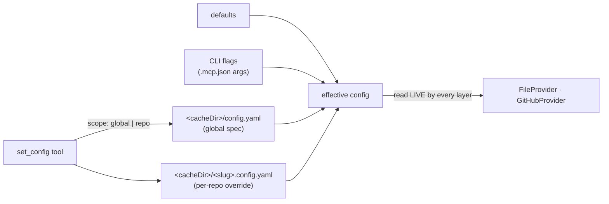

# Configuration

Two distinct kinds of knob: user preferences (central config, set through the server) and
deployment flags (how the server itself is launched). Nothing is ever configured by files
inside the user's repo.

## central config

`ConfigProvider` — one class in `src/core/providers/config.ts`, beside the layers it
configures. Preferences are written only via the `set_config` MCP tool and stored beside the
task caches: one **global spec** (`<cacheDir>/config.yaml`) applying to every repo,
overridable per repo (`<cacheDir>/<slug>.config.yaml`). Precedence, weakest first:
defaults < CLI flags < global spec < per-repo override. `get_config` shows every layer plus
the effective result (the CLI's read-only `config` command prints the same).

Configurable: `provider`, `projects`, `projectNumber`, `board`, `labels`, `labelFields`.
Files are zod-parsed (`ProjectConfigSchema`): an unknown key or mistyped value fails loudly,
naming the file. Config reads are mtime-memoized and taken LIVE — a `set_config` affects the
very next write, and the GitHub layer's state cache is keyed by the effective config, so
board/projects changes rebuild state like label changes.

### Gotchas

- The in-repo `.claude/tasks-mcp.config.yaml` of v0.2–v0.7 is gone — see `lessons.yaml`
  ("Configuration left the user's repo for the server").
- Every layer shares the ONE ConfigProvider instance; `GitHubProvider` requires it (no silent
  default).

## deployment flags

How the server is deployed — set once, in `.mcp.json`'s `args` (or the shell): `--http` /
`--port <n>` (transport; stdio default, HTTP on 3917), `--provider <name>` (default `github`),
`--project-number <n>`, `--no-projects`, `--board <title>` (default `Tasks`),
`--cache-dir <dir>` (default OS cache dir). Credentials are environment-only:
`GITHUB_TOKEN` / `GH_TOKEN`, else `gh auth token`.

### Example

The `mcp-registration` example in `examples.yaml`; with flags:
`{ "args": ["-y", "@outputty/tasks-mcp", "--no-projects"] }`.

### Gotchas

- Flags sit BELOW the global spec in precedence: a `set_config` value overrides a flag. Flags
  are deployment defaults, not rulings.
