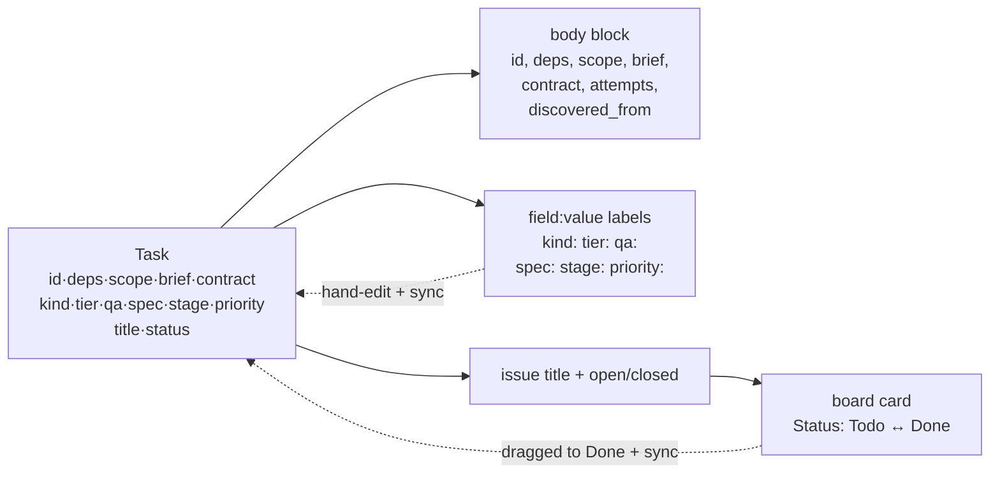

# The task ↔ GitHub mapping

What a task looks like on GitHub: the body block, the labels, the board, and how strangers'
issues join. The stack rules that decide who wins a disagreement belong to
[provider stack](provider-stack.md).



## body block

A hidden YAML block leads every managed issue's body:

```
<!-- outputty:task
id: readme-prereqs-order
deps: []
scope:
  - README.md
brief: "README.md's prereqs example outputs order [[schema],[api,infra]] ..."
-->
```

(real observed, issue #13 of outputty/tasks-mcp — the `add-task` example). `id` comes first —
the stable key that survives title edits. The block carries only what labels cannot: `deps`,
`scope`, `brief`, `contract`, `attempts`, `discovered_from`. An issue is **managed** iff its
body carries the block; prose a human writes below it is preserved across updates.

### Gotchas

- Labels win over a legacy block that still carries scalar fields (pre-v0.8 issues).
- The block IS the management marker — there is no marker label anymore.

## field:value labels

The execution properties — `kind`, `tier`, `qa`, `spec`, `stage`, `priority` — are worn as one
GitHub label each (`tier:2`, `priority:high`), color-coded per field, created on demand.
Observed live on issue #13: `["tier:1", "qa:inline", "priority:normal"]`. Edit a label in the
GitHub UI and the next `sync` pulls the change into the task.

Foreign labels (`bug`, `help wanted`, …) are never touched. A hand-typed junk value
(`tier:banana`) parses to `undefined` and is ignored, never crashed on. `labelFields` config
narrows which properties become labels; `labels: false` turns label sync off entirely.

### Gotchas

- `kind` has a label but no `add` parameter on any surface — tracked as task
  `kind-not-settable`.
- The value domains the parser accepts are the const arrays in `src/core/types.ts` — one
  source for types, validators, zod enums, and the parser.

## kanban board

Each task-issue is added to a Projects v2 board and its **Status** column tracks the task:
`open → Todo`, `done → Done` — and flows back, a card dragged to Done marking the task done on
the next `sync`. By default the server finds or creates a board named **Tasks** linked to the
repo (observed live: board "Tasks", project number 2 on outputty/tasks-mcp); `projectNumber`
targets an existing board; `--no-projects` turns it off.

### Gotchas

- Best-effort: a board hiccup is a warning, never a lost task — the issue write decides
  success.

## adoption

`sync` imports any repo issue WITHOUT the block as a task `gh-<number>` and stamps its body,
preserving the human's prose below the block — so an issue a teammate opened by hand is
tracked from then on, round-tripping like any other task.

### Gotchas

- Adoption exists because the id left the labels for the body (v0.2): without a label, only
  stamping makes a hand-opened issue visible to future syncs. See `lessons.yaml`.

## project scope requirement

The board needs the token's `project` scope. Without it, tasks still land as issues and the
board sync is skipped with a warning (verified live, 9f28db0). One-time fix:

```
gh auth refresh -s project
```

## label mutations need a preview header

GitHub's `createLabel` GraphQL mutation is still behind an API preview: label mutations send
`accept: application/vnd.github.bane-preview+json` (`src/core/providers/github.ts:427`).
Re-verify against GitHub's changelog before removing the header; dropping it breaks on-demand
label creation.
