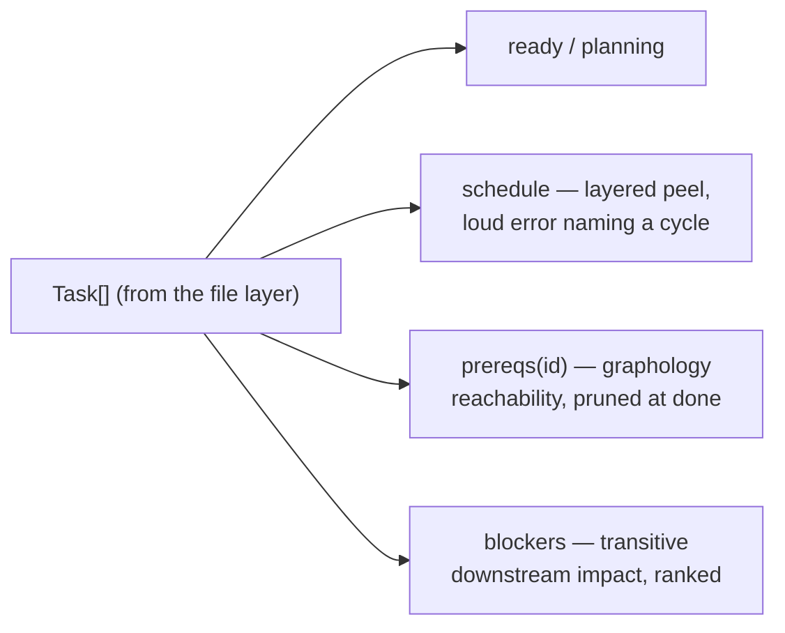

# The graph engine

The pure heart: every graph question is a function of `Task[]` — no I/O, no provider, directly
unit-tested. How tasks get INTO that array belongs to [provider stack](provider-stack.md); how
the answers reach a caller belongs to [surfaces](surfaces.md).

## graph engine

`src/core/graph.ts`. Reachability (`prereqs`, `blockers`) runs on
[graphology](https://graphology.github.io/) — the maintained standard. Traversal prunes at
done tasks: a finished task already satisfied its side of the graph, so it never appears in an
answer. `schedule` keeps its 15-line hand-rolled peel because its error contract — naming the
cycle's members — is API.

### Example

The `schedule` example in `examples.yaml`: the canonical graph peels into
`[["infra","schema"], ["api"], ["deploy","ui"]]` (real observed).

## prereqs

"I want to start on X — what has to be done first?" Answers with `startable` (nothing in the
way), `order` (dependency-ordered layers: finish layer 1, then 2, then start X), and the full
records of every task named.

### Example

The `prereqs` example in `examples.yaml` — real observed on the canonical graph:
`{ "id": "deploy", "startable": false, "order": [["infra", "schema"], ["api"]], ... }`.

### Gotchas

- Done deps end the chain and never appear; `startable: true` comes with an empty `order`.
- The README's example output disagrees with the engine — tracked as task
  `readme-prereqs-order`.

## blockers

"What holds up the most work right now?" Every open task ranked by `blocks` — how many open
tasks transitively wait on it — with `blocked` (their ids), `highPriorityBlocked` (the
high-priority ones, for priority alignment), and `unblockedBy` (the dependency-ordered path to
make it workable; empty means work it now). The whole answer computes from one graph, built
once.

### Example

The `blockers` example in `examples.yaml` — real observed: `schema` first with `blocks: 3`,
`unblockedBy: []`.

## ready / planning / schedule

The working set. `ready` = open, spec settled, every dep done — what a build sweep dispatches.
`planning` = spec `drafting` or `replan` — what the planning stage still owns. `schedule` =
the whole open plan as layers; a dependency cycle is a loud error naming its members, never a
silent drop.

### Example

The `ready-and-planning` example in `examples.yaml`: this repo's own tracker after bootstrap —
six ready, two in planning.
