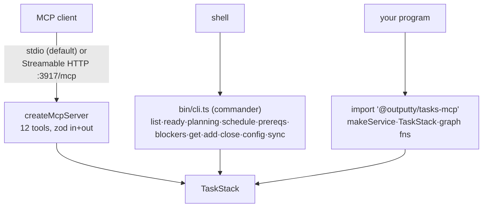

# The surfaces

The three ways in — MCP tools (primary), CLI (human/scripts), library (importable core) — all
over the same `TaskStack`. What the tools DO belongs to [graph engine](graph-engine.md) and
[provider stack](provider-stack.md); this file covers how a caller reaches them.

## MCP server

The primary surface: `createMcpServer` on the official `@modelcontextprotocol/sdk` — never a
hand-rolled JSON-RPC handler. 12 tools (`list_ready`, `list_planning`, `schedule`, `get_task`,
`add_task`, `amend_task`, `close_task`, `sync`, `prereqs`, `blockers`, `get_config`,
`set_config`), each declaring zod input AND output schemas and returning `structuredContent`.
Every tool takes `project` — the absolute repo path — because the server has no working
directory of its own.

Transports: `StdioServerTransport` (default) and stateless Streamable HTTP (JSON responses) on
plain `node:http` — no framework; the server itself answers non-POST `/mcp` with `405 + Allow`
so the SDK transport can never hold a GET open as SSE. `SERVER_INFO` reads name/version from
`package.json` at build time.

### Example

The `mcp-registration` example in `examples.yaml`.

### Gotchas

- Reads never touch the network (file layer); the first GitHub-touching call (a write, or
  `sync`) runs init once — repo, credentials, labels, board.
- The `sync` tool's description still advertises the dead seed mechanism — task
  `sync-tool-desc-seed`.

## CLI

`bin/cli.ts` on commander (user ruling: a real CLI library, never homebrew argv parsing). With
no command it runs the MCP server; subcommands drive the core directly: `list`, `ready`,
`planning`, `schedule`, `prereqs <id>`, `blockers`, `get <id>`, `add <id>`, `close <id>`,
`config`, `sync`. `--project` defaults to cwd; the deployment flags work on every command.

### Example

The `ready-and-planning` example in `examples.yaml`.

### Gotchas

- No `amend` subcommand (MCP-only), and `config` is read-only (set via `set_config`) — known
  asymmetries.
- `prereqs`/`blockers` print compact forms (layers only; blockers as a flat table without
  `unblockedBy`) — the MCP tools return the full shapes.

## library

The core is importable; the MCP layer is a wrapper, never a requirement. `.` exports
`makeService`/`TaskStack`, `FileProvider`/`GitHubProvider`/`buildStack`, the pure graph
functions (`ready`, `planning`, `schedule`, `prereqs`, `blockers`, `priorityOf`),
`ConfigProvider`/`ProjectConfigSchema`/`projectSlug`, `DuplicateTaskError`, and the types.
`./mcp` exports `createMcpServer`/`createHttpServer`/`runStdio`.

### Example

The `library-blockers` example in `examples.yaml` — real observed output: `schema`.

### Gotchas

- v0.7.0 broke this surface once: `CachedTaskService` → `TaskStack`, `stackFor` → `buildStack`
  (v0.8.0), `Cache`/`Refs`/`CacheEntry`/`providerFor` gone.

## branch parameter unused

`ProjectContext.branch` (`src/core/types.ts:55`) is declared, documented ("the backend decides
how it uses this"), accepted by every tool schema — and read by nothing, in any of the 16
commits since the initial import. Ruled (grill 2026-08-17): REMOVE it — task
`unused-branch-param`, spec settled, ready to build. Probe: `rg '\.branch' src/` finds only
the pass-through.
