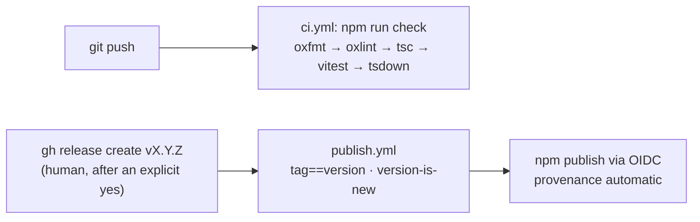

# Toolchain, tests, and releasing

The development machinery: the build gate, the test discipline, the runtime split, and the
publish pipeline. Product behavior belongs to the other topic files.

## oxc toolchain with working-set caps

One toolchain end to end: oxfmt (formatting), oxlint (linting **with build-enforced caps**:
complexity ≤ 7, ≤ 24 lines per function, nesting ≤ 3, no-else-return with else-if banned),
TypeScript 7 (the native compiler) for typechecking, vitest, tsdown (Rolldown + oxc) to
`dist/`. `npm run check` chains exactly what CI runs — run it before calling any change done.

Fix a cap violation by decomposing, never by loosening the threshold; a deviation is a
targeted disable comment with a written why (the one on `createMcpServer`'s declarative tool
table is the standing example).

### Gotchas

- `oxc-transform` is the low-level API inside tsdown, not a tool to drive directly.
- oxfmt reads `.prettierignore`; plugin-managed files (`CLAUDE.md`, `.claude/`) are excluded
  there.

## e2e tests nock at the wire

Tests drive the real stack — provider, service, protocol, transport — and fake only the wire:
**nock** answers api.github.com (GraphQL), test repos are real `git init` temp dirs (repo
resolution runs for real), and the MCP suite connects the official SDK client over real HTTP.
No in-memory fake providers. Two carve-outs: `graph.ts` keeps pure unit tests (no I/O to
mock), and `MockProvider` exists only as the controllable deepest layer in the stack-semantics
suite.

### Gotchas

- A test that times out at exactly its limit is hanging, not slow — the standing example is
  the MCP hang fixed by 405-on-non-POST + `closeAllConnections` (see `lessons.yaml`).

## runtime portability

The published package runs on Node ≥ 18 **and** bun; developing needs Node ≥ 22. No Bun-only
APIs in `src/`/`bin/` — `yaml`, `node:crypto`, `node:child_process`, `node:http`, process
streams. Two hard edges:

- `npm test`, **never `bun test`**: nock needs Node's fetch and cannot intercept Bun's.
- tsdown loads its TS config via the optional `unrun` peer on Nodes without native type
  stripping; `unrun` needs `Promise.withResolvers`, so CI runs Node 24.

## publish pipeline

Pushing code never publishes — a push only runs CI. Publishing fires ONLY when a GitHub
Release is published: `publish.yml` guards tag == `package.json` version and version-is-new,
runs the full check, then `npm publish` via **OIDC Trusted Publishing** — no stored token,
provenance attached automatically. Real observed: 0.5.0/0.6.0/0.7.0/0.8.0 on the registry.

The human rule (CLAUDE.md): when shippable code changes and tests pass, ASK whether to
release; never create a release unprompted. On a yes: bump version, commit, push,
`gh release create vX.Y.Z --generate-notes`.

### Gotchas

- The first publish of a NEW package must be manual — OIDC cannot create one.
- The trigger pivoted Release → tag-push → Release in one day; the settled reasoning is in
  `lessons.yaml`.
