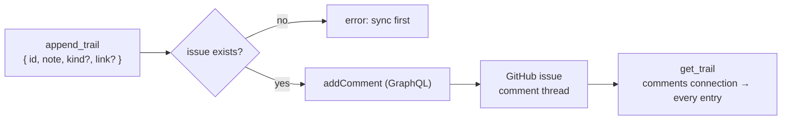

# Per-task trails

A task's **trail is its GitHub issue comment thread**. There is no separate trail store — the provider
that owns the issue owns its comments, so trails ride the same [GitHub layer](provider-stack.md) as
tasks. `append_trail` posts a comment; `get_trail` reads the whole thread. **Every comment is an entry**,
people's comments included.

## The seam

The `Provider` interface gained two **optional** methods, `getTrail` / `appendTrail`. `GitHubProvider`
implements them; `FileProvider` does not. So the service's `getTrail`/`appendTrail` walk the stack from
the bottom and use the **deepest layer that backs trails** — GitHub. A file-only project (no remote)
has no trail surface and the call throws `trails need a GitHub-backed project`.

- `appendTrail(id, entry)` → look up the issue node id in the layer's task→issue index → `addComment`
  → re-read the thread. No issue for the id (never synced) → `no task <id> on GitHub — sync it first`.
- `getTrail(id)` → the issue's `comments` connection, paginated, oldest first. No issue → `[]`.

## Every comment is an entry, kind/link on a hidden marker

An entry is `{ note, kind?, link?, author?, at? }`. `note` is the comment body; `author` (GitHub login)
and `at` (ISO 8601) come from GitHub on read. Because **every** comment counts, a comment a person wrote
by hand comes back as a bare `note` plus its `author`/`at`.

`kind` (`decision` · `action` · `note`) and `link` are optional and only outputty writes them — encoded
in a leading `<!-- outputty:trail kind=… link=… -->` marker, then the note. The marker is an HTML
comment, so GitHub renders the comment as plain text; `splitMarker` parses it back on read. Real observed
(the `trail-journal` example): a `decision` comment round-trips its kind and link; a plain `note` comment
comes back with neither.

### Gotchas

- Reads hit the network (there is no local trail cache) — unlike task reads, which the file layer
  answers offline.
- `append_trail` needs the issue to exist first. A task created offline, or before its first `sync`, has
  no issue to comment on yet.
- `kind` must be one of `TRAIL_KINDS`; a junk `kind` on append is rejected. A junk `kind=` in a
  hand-written marker is ignored on read (the entry keeps its note).
- History: the first cut (v0.9.0, shipped to npm) stored trails in a local `.trails/<id>.yaml` file,
  never synced. Reworked minutes later in v0.10.0 (ruled 2026-08-17) to back them with issue comments —
  one provider for tasks and their trails. Both versions are published. See `lessons.yaml` / roadmap #6.
