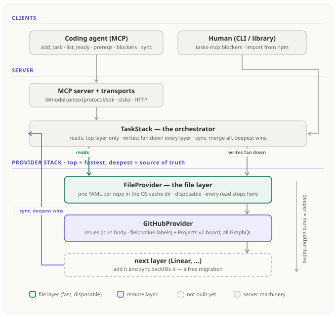

# @outputty/tasks-mcp

A local **MCP server** that gives a coding agent a dependency-aware task tracker. The agent calls typed
tools — `add_task`, `list_ready`, `prereqs`, `blockers`, `sync` — over a task graph that is mirrored
two-way into GitHub: one issue per task, `field:value` labels for its execution properties, and a
Projects v2 kanban board.

Tasks live in a **stack of provider layers**: a local file on top (every read is instant and offline),
GitHub beneath it as the source of truth. Deleting the local file loses nothing — `sync` rebuilds it.



## Install

No clone. Add the server to your project's `.mcp.json` and your MCP client launches it on demand:

```json
{
  "mcpServers": {
    "tasks": { "command": "npx", "args": ["-y", "@outputty/tasks-mcp"] }
  }
}
```

Requirements: **Node ≥ 18** (or bun), a repo with a github.com `origin` remote, and either `gh` logged
in or `GITHUB_TOKEN` set. For the kanban board, grant the token the `project` scope once:
`gh auth refresh -s project` (without it, tasks still land as issues and the board is skipped with a
warning).

## The two questions it answers

The tracker is a dependency graph, and the two questions a graph is FOR each have a dedicated tool.

### "I want to start on task X — what has to be done first?"

```jsonc
// tool: prereqs        { "project": "/abs/repo", "id": "deploy" }
{
  "id": "deploy",
  "startable": false,
  "order": [["schema"], ["api", "infra"]], // finish layer 1, then layer 2, then start deploy
  "tasks": [
    {
      "id": "schema",
      "status": "open",
      "deps": [],
      "summary": "Design the schema",
      "tier": 3,
      "qa": "subagent",
      "priority": "normal",
    },
    {
      "id": "api",
      "status": "open",
      "deps": ["schema"],
      "summary": "Build the API",
      "tier": 2,
      "qa": "inline",
      "priority": "high",
    },
    {
      "id": "infra",
      "status": "open",
      "deps": [],
      "summary": "Provision infra",
      "tier": 3,
      "qa": "subagent",
      "priority": "normal",
    },
  ],
}
```

`startable: true` with an empty `order` means nothing is in the way — start now. Done tasks never
appear: a finished dependency ends the chain.

### "What is the biggest blocker right now?"

```jsonc
// tool: blockers       { "project": "/abs/repo" }
{
  "blockers": [
    {
      "id": "schema", // the single biggest bottleneck: first entry, most waited-on
      "summary": "Design the schema",
      "priority": "normal",
      "blocks": 3, // how many open tasks transitively wait on it
      "blocked": ["api", "ui", "deploy"],
      "highPriorityBlocked": ["ui"], // how it aligns with priorities
      "unblockedBy": [], // the path to it, dependency-ordered (empty: work it now)
    },
    {
      "id": "infra",
      "summary": "Provision infra",
      "priority": "normal",
      "blocks": 1,
      "blocked": ["deploy"],
      "highPriorityBlocked": [],
      "unblockedBy": [],
    },
  ],
}
```

Read it top to bottom: the first entry unblocks the most work; `unblockedBy` is what has to happen to
even get to it; `highPriorityBlocked` shows whether clearing it serves the priorities.

## The tools

Every tool takes `project` — the absolute path to the repo it acts on — because the server has no
working directory of its own. Reads are answered from the local file layer and never touch the
network; the first GitHub-touching call (a write, or `sync`) resolves repo, credentials, labels, and
the board once.

| Tool            | Answers                                                         | Writes |
| --------------- | --------------------------------------------------------------- | ------ |
| `prereqs`       | what must be done before this task can start, in build order    | —      |
| `blockers`      | which tasks hold up the most work, ranked                       | —      |
| `list_tasks`    | every task, full records — the whole graph                      | —      |
| `list_ready`    | which tasks can be worked right now (open, settled, deps done)  | —      |
| `list_planning` | which tasks planning still owns (drafting / replan)             | —      |
| `schedule`      | the whole open plan as dependency layers; errors on a cycle     | —      |
| `get_task`      | one task's full record                                          | —      |
| `add_task`      | create a task (file + issue + labels + board card)              | ✎      |
| `amend_task`    | widen an open task's scope, or set its brief                    | ✎      |
| `edit_task`     | edit any field of a task (only the fields you pass change)      | ✎      |
| `close_task`    | mark done (closes the issue, moves the card)                    | ✎      |
| `delete_task`   | permanently delete a task + its issue (needs delete permission) | ✎      |
| `get_trail`     | a task's trail: its issue comment thread, oldest first          | —      |
| `append_trail`  | append one entry to a task's trail (posts an issue comment)     | ✎      |
| `sync`          | reconcile every layer both ways; adopt hand-opened issues       | ✎      |

A task carries: `id`, `title`, `status`, `deps`, `scope`, the execution-modifying properties `tier`
(1–4), `qa` (skip/inline/subagent), `priority` (high/normal/low), `spec`, `stage`, `kind`, and
`brief`/`contract` prose. On GitHub, the scalar properties are worn as **`field:value` labels**
(`tier:2`, `priority:high`, …) — visible, filterable, and editable in the GitHub UI; edit a label
there and `sync` pulls the change back. The issue **body renders a concise summary** — the brief (the
problem and expected solution), then **What to account for** (the contract) — for the web UI,
regenerated on every write, with the machine-readable record kept in a hidden block above it. See
[docs/architecture.md](docs/architecture.md) for the full mapping.

## Trails — the decisions behind a task

A task's **trail is its GitHub issue comment thread**. `append_trail` posts a comment; `get_trail` reads
the whole thread back, oldest first — so the decisions and actions behind a task live right on the issue,
and **every comment counts**, including ones people write by hand.

```jsonc
// append_trail  { "project": "/abs/repo", "id": "readme-prereqs-order",
//                 "kind": "decision", "note": "prereqs example outputs [[schema],[api,infra]]",
//                 "link": "README.md:42" }
{
  "trail": [
    {
      "kind": "decision",
      "note": "prereqs example outputs [[schema],[api,infra]]",
      "link": "README.md:42",
      "author": "octocat",
      "at": "2026-08-17T19:30:00Z",
    },
  ],
}
```

`note` is the comment body; `author` and `at` come from GitHub. `kind` (`decision` / `action` / `note`)
and `link` are optional — outputty tucks them into a hidden marker on the comments it writes, so the
comment still renders as plain text on GitHub while round-tripping the tags. A comment a person leaves by
hand has no `kind`/`link`, just its `note`, `author`, and `at`. Trails need a GitHub-backed project;
`append_trail` requires the task's issue to exist (`sync` it first).

## Configuration

Preferences are configured **centrally, through the server itself** — the `set_config` tool writes
them, they are stored beside the task caches (never in your repo), and they propagate to every
provider layer:

```jsonc
// set_config — a global spec that applies to every repo…
{ "project": "/abs/repo", "scope": "global", "config": { "labels": true, "board": "Tasks" } }
// …overridable per repo:
{ "project": "/abs/repo", "scope": "repo", "config": { "labelFields": ["tier", "priority"] } }
```

Precedence, weakest first: defaults < CLI flags < global spec < per-repo override. `get_config` shows
every layer plus the effective result. Configurable: `provider`, `projects`, `projectNumber`,
`board`, `labels` (label sync on/off), `labelFields` (which properties become labels). Everything is
zod-validated — a typo'd key or mistyped value fails loudly, naming the file.

Deployment flags (in `.mcp.json`'s `args`, e.g. `["-y", "@outputty/tasks-mcp", "--no-projects"]`):

| Flag                    | Description                                             | Default       |
| ----------------------- | ------------------------------------------------------- | ------------- |
| `--http` / `--port <n>` | standalone HTTP server instead of stdio                 | stdio, `3917` |
| `--provider <name>`     | the remote layer backing each project                   | `github`      |
| `--project-number <n>`  | target an existing Projects board                       | find/create   |
| `--no-projects`         | disable the board sync                                  | board on      |
| `--board <title>`       | board title to find/create                              | `Tasks`       |
| `--cache-dir <dir>`     | where the file layer + config live                      | OS cache dir  |
| `--sync-interval <s>`   | background sync cadence while the server runs (0 = off) | off           |

Credentials come from `GITHUB_TOKEN` / `GH_TOKEN`, else `gh auth token`.

## More

- **[Architecture](docs/architecture.md)** — the provider stack, sync semantics, and the task ↔ GitHub
  mapping (body block, labels, board).
- **[CLI](docs/cli.md)** — the same tracker as shell commands (`tasks-mcp blockers`), no MCP involved,
  plus the library API.
- **[Development](docs/development.md)** — building, testing, and releasing this package.
