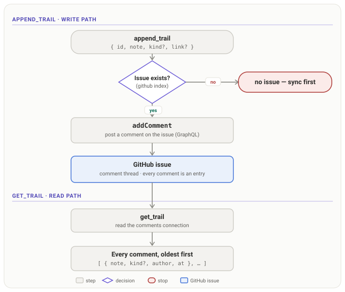

# Architecture

The package is split into a **core** (all the business logic, importable as a library) and a thin
**MCP wrapper** over it. The core's centre is the **provider stack**.

The swimlane below reads like the system runs: rows are the layers, columns are the stages of one
call — down a stage column, then right to the next stage.

## The provider stack

Every layer implements one seam — `init` / `pull` / `upsert` — and the `TaskStack` service
orchestrates them as an ordered list, top-first:

- **`FileProvider` (top).** One YAML file per project under the OS cache dir
  (`<cacheDir>/<repo>-<hash>.yaml`), never in the repo. Every read is answered here, so `list_ready`,
  `prereqs`, and `blockers` are instant and work offline. The file is disposable: `sync` rebuilds it
  from the layers below.
- **`GitHubProvider`.** One issue per task, a Projects v2 board card per issue, all over GraphQL. The
  layer keeps a private index (task id → issue/card node ids) built from one listing pass, so nothing
  above the seam ever sees a GitHub handle and a same-id write can never duplicate an issue.
- **Any further layer.** The machinery is N-layer: tests run a three-layer stack. Adding a layer is a
  free migration — the next `sync` backfills it with every task.

Three rules govern the stack (and are pinned by tests):

1. **Deepest wins.** `sync` pulls every layer, merges with the deepest layer taking precedence on any
   disagreement, then pushes the merged truth back into each layer that lacks a task or disagrees. An
   issue closed in the GitHub UI beats the local file on the next sync.
2. **Absence is not a claim.** A task missing from a layer — including an empty, newly added layer —
   is pushed into it, never deleted from the others.
3. **Deletions never propagate.** A task can close everywhere, but only vanishes by hand.

The service is an orchestrator: it sequences layer calls and knows nothing of their internals. Errors
bubble; the only catches sit where business logic demands a fallback (the board is best-effort — a
board hiccup is a warning, never a lost task).

## The task ↔ GitHub mapping

A task's full record round-trips through its issue, split across three homes:

| Task field                                                                | GitHub home                                                              |
| ------------------------------------------------------------------------- | ------------------------------------------------------------------------ |
| `id`, `deps`, `scope`, `brief`, `contract`, `attempts`, `discovered_from` | a hidden YAML block leading the issue body (`id` first — the stable key) |
| `kind`, `tier`, `qa`, `spec`, `stage`, `priority`                         | **labels**, one `field:value` each (`tier:2`, `priority:high`, …)        |
| `title` / `status`                                                        | issue title / open ↔ closed                                              |

An issue is "managed" iff its body carries the block. Below the hidden block, the body renders a
**visible, concise summary** — the brief (the problem and expected solution), then **What to account
for** (the contract) — wrapped in `<!-- outputty:spec -->` sentinels and **regenerated on every write**,
so the issue reads cleanly in GitHub's web UI. Metadata (scope, deps) stays in the block, not the
summary. The regenerated region is stripped on read; genuinely human-written prose below it is preserved
across updates.

**Labels are first-class.** They make the execution properties visible and filterable in the GitHub
UI, and they are writable there too: change `tier:2` to `tier:1` on the issue and the next `sync`
pulls it into the task. Missing labels are created on demand (color-coded per field); labels the
tracker does not manage (`bug`, `help wanted`, …) are never touched; a hand-typed junk value
(`tier:banana`) is ignored rather than crashed on. Labels win over a legacy body block that still
carries those fields.

## The kanban board (GitHub Projects v2)

Each task-issue is added to a Projects v2 board and its **Status** column tracks the task
(`open → Todo`, `done → Done`) — and flows back: a card dragged to Done marks the task done on the
next `sync`. By default the server finds or creates a board named **Tasks** linked to the repo; point
it at an existing board with `projectNumber`, or turn it off with `--no-projects`.

The board needs the token's `project` scope (`gh auth refresh -s project`). Without it the board is
skipped with a warning and issues remain the status source.

## Sync semantics

`sync` reconciles every layer of the stack both ways:

- **Status converges.** A task is done when its issue is closed or its card sits in a Done column;
  `sync` writes that everywhere — cache, issue state, card column all agree after.
- **Hand-opened issues are adopted.** Any repo issue without the block is imported as a task
  (`gh-<number>`) and its body stamped, so it is tracked from then on.
- **Offline tasks are pushed.** A task added while a layer was unreachable is created there on the
  next `sync`.
- **A new layer backfills.** Adding a layer to the stack is configuration, not migration tooling.
- **Duplicates are detected, never deleted.** If two issues ever claim the same task id (a race, or a
  hand-written block), every read resolves deterministically to the OLDEST issue, the collision is
  logged, and `sync` counts it in `conflicts` — merging or closing the newer duplicate is a human
  call.
- **A corrupt task file self-heals.** An unparseable YAML file is quarantined (renamed `.corrupt`)
  instead of crashing reads; the layer continues empty and the next `sync` rebuilds it from the
  layers below — safe because absence is not a claim and GitHub is deeper.

## Trails — the issue comment thread

A task's **trail is its GitHub issue comment thread**. There is no separate trail store: the provider
that owns the issue owns its comments, so trails ride the same GitHub layer as tasks. `append_trail`
posts a comment (`addComment`); `get_trail` reads the issue's `comments` connection — GraphQL, like the
rest of the layer. The `FileProvider` has no comment surface, so the service routes trail calls to the
deepest layer that backs them (GitHub).

**Every comment is an entry**, people's included, so `get_trail` returns the whole discussion. `kind`
and `link` are optional and ride a hidden `<!-- outputty:trail … -->` marker on the comments outputty
writes — invisible in GitHub's rendered view, parsed back on read — so a plain human comment reads as a
bare `note` plus its GitHub `author` and timestamp. Consequences: trails need a GitHub-backed project,
`append_trail` requires the issue to exist (sync first), and reads hit the network — there is no local
trail cache.

## Configuration — its own provider

The server carries no user preferences of its own: `ConfigProvider` is a class of its own, and the MCP
tools `get_config` / `set_config` are its surface. Preferences are stored beside the task caches —
one **global spec** (`<cacheDir>/config.yaml`) applying to every repo, overridable per repo
(`<cacheDir>/<repo>-<hash>.config.yaml`). Precedence, weakest first: defaults < CLI flags < global
spec < per-repo override. Every provider layer reads the same ConfigProvider, so a preference set
centrally propagates to all of them — label preferences are read live, taking effect on the very next
write. Files are zod-parsed; unknown keys and mistyped values fail loudly with the file's path.

## Init

There are no async constructors, so each layer has an explicit `init(ctx)`: everything remote is
resolved once per project — the repo behind `origin`, config, the repository node id, the label set,
and the board (found or created). Reads never trigger it; the first write or `sync` does.

## The graph engine

`ready`, `planning`, `schedule`, `prereqs`, `blockers`, and `eligible` are pure functions of a
`Task[]` — no I/O, no provider. Reachability (`prereqs`, `blockers`, `eligible`) runs on
[graphology](https://graphology.github.io/); traversal prunes at done tasks, because a finished task
already satisfied its side of the graph.

`eligible` ranks the ready tasks by `(blocks + 1) × priorityWeight` — high 3, normal 2, low 1.
Priority **multiplies** reach rather than outranking it, so a low task blocking five beats a high task
blocking none, while priority decides between tasks of comparable reach. The ranking is a default
order for a caller to start from, never the decision: an orchestrator reads the roadmap before it
chooses.

## The roadmap altitude

The graph holds two kinds of record. A **task** is a unit of work; a **target** is a roadmap item that
groups the tasks serving it. One field distinguishes them (`type`), one joins them (`target`), and
because a target is an ordinary node every existing graph function works one altitude up unchanged —
`prereqs` on a target is "what must ship before this", `blockers` ranks targets by reach. `ready`
excludes targets, so nothing dispatches a roadmap row as if it were a build, and `roadmap` returns
every target with progress **derived** from its tasks.

On GitHub a task's `target` **is** its issue's parent (`addSubIssue` with `replaceParent`, so a move is
one mutation). The edge is the field's only home — it is not written into the body block — so
re-parenting an issue in the web UI flows back on the next sync, and reading membership is free:
`parent` rides the issue listing the provider already pages through. `type` is the exception that does
ride the block as well as its label, because with `labels: false` a target would round-trip as a plain
task and be dispatched.

Like the board, the edge is **best-effort**: GitHub caps a parent at 100 sub-issues and refuses one
whose repository owner differs, and neither is worth failing the issue write over. `sync` pushes
targets ahead of the tasks naming them, so a first sync attaches the edge in one pass.

## The channel — one doorbell, two hops

The MCP server declares the `claude/channel` capability, so Claude Code registers a notification
listener and the server can push `notifications/claude/channel` into a live session.
`claude/channel/permission` is deliberately **not** declared: relay forwards tool-approval prompts to
whoever is on the other end of a channel, and here that is a spool file, not a human.

Exactly one event exists, and it carries no state to act on. Channel events are delivered on the
session's next turn and batched, so any count stamped at emit time would be stale by the time it is
read; the reader calls `list_ready` instead. What the ring text does carry is the **direction** to
look — `task api closed — re-evaluate`, `ready now: deploy — re-evaluate` — because a bare "something
changed" is too easy to reconcile with a stale belief that nothing has.

Two mechanisms carry a ring, because a worker session and an orchestrator never share a process:

| Hop           | Mechanism                                                           | Where             |
| ------------- | ------------------------------------------------------------------- | ----------------- |
| in-process    | `Doorbell` — coalesces every ring in one tick into a single event   | `core/channel.ts` |
| cross-process | a spool file per note, broadcast to every session watching the repo | `core/channel.ts` |

`TaskStack.notify` does both: it rings locally _and_ posts to the spool, and a reader skips notes it
posted itself so one ring is never delivered twice. The spool keys on `repoSlug` — the primary
checkout, resolved through `git rev-parse --git-common-dir` — rather than on `projectSlug`, so a note
raised in a worktree reaches a session watching from the checkout it was cut from.

**The spool is a broadcast, not a queue.** Reading it never removes a file. Every session's server
reads the spool, but only some of them have a channel listener behind their doorbell — so a note
_consumed_ by a worker session is a note the orchestrator never sees, and with instant delivery that
race is near-certain rather than occasional. Instead each `EventLog` remembers the files it has handed
over, so a note reaches every process exactly once, and files are swept by age (five minutes, read
from the filename so sweeping costs no `stat`).

**The spool is watched, not polled.** `EventLog.watch` puts an `fs.watch` on the spool directory the
first time a project is named, so a note lands in the other session immediately and with no
configuration — the wake path must never depend on a flag someone has to remember. A dropped `fs.watch`
event self-heals, since the next one re-reads the whole directory and hands over anything unseen; the
background sync reads the same log as a further backstop.

Three things ring: an **explicit `notify`**, a **graph mutation** (`create`, a status/spec/deps change,
`delete` — announced to other processes but not to the session that made it, which already knows), and
a **background sync whose eligible set moved**. A prose-only edit rings nothing; a retitled task is not
news. Only the **stdio** transport wires the doorbell to a notification (`mcp/stdio.ts`), because that
is how Claude Code spawns a channel server. Under HTTP the ring goes nowhere and every tool still
works.

**The in-flight set is in the graph, not in the dispatcher.** A worker calls `start_task` as it picks
a task up: `status` moves to `in_progress`, `ready` matches only `open`, and the task stops being
offered. On GitHub the issue stays **open** and wears a `status:in_progress` label — GitHub has no
issue state for "someone is on it" — while the board card moves to its In Progress column, so dragging
a card there in the web UI flows back on the next sync. The marker clears itself: closing sets `done`,
and `spec: replan` returns the task to `open`, so a build that abandons cannot strand it.

An in-progress task is still **scheduled** and still counts as a **blocker** — it is being worked, not
finished, so everything behind it still waits on it. What remains the caller's is only **how many** may
run at once — this package holds the graph, not the schedule.
